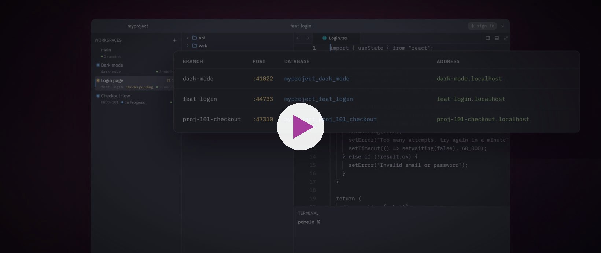

  

<h1 align="center">Pomelo</h1>

  Every branch gets its own running stack. 
  A native macOS app for multi-repo projects. Free and open source.

  
  
  
  

  
   
  <a href="https://pomelohq.app/#film">Watch the film (1:14)</a>

Your agents finished three branches. Now run them: port 3000 is taken, one migration breaks the other
branch, and you are back to stop, stash, switch, re-seed.

Pomelo gives every branch of a multi-repo project its own running environment, side by side: its own git
worktrees, ports, databases and address, next to a code editor, terminals and your AI agent.

- **Website and docs:** https://pomelohq.app
- **Download (macOS):** https://github.com/pomelohq/pomelo/releases/latest
- **Source:** https://github.com/pomelohq/pomelo

## What it does

- **One running stack per branch.** Worktrees for every repo, its own ports and databases seeded from main.
  Branches never collide, and switching restarts nothing.
- **Services that say what broke.** Each service shows its state and the last line it printed; a port clash
  moves to a free port in one click.
- **Agents in the loop.** Hand a crash to Claude with the error attached. Through Pomelo's tools it reads that
  branch's own logs and database.
- **Review and ship across repos.** One message, one commit per repo, push, and the pull request's checks show
  on the workspace.
- **Native and self-contained.** One Rust app with a GPU-drawn UI and the core built in: no daemon, no local
  server, notarized, updates itself.

Open source, AGPL-3.0.
